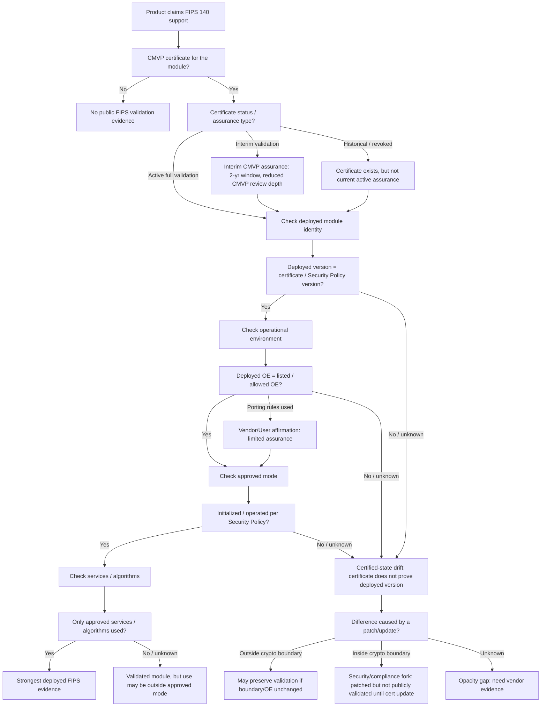

# FIPS 140-3 Validated-Module Corpus — Findings
*n = 415 FIPS 140-3 modules (a near-census of cert window #4650–#5159), normalized deterministically from the certificate page + Security Policy PDF. Reference date 2026-07. Lifecycle / archetype / algorithm / drift figures use all 415; Security-Policy-structure figures (TCB motifs, review-priority, document quality) use the 136 modules with full SP extraction.*
## Executive finding
**A FIPS 140-3 certificate proves that a specific module *version*, in a specific configuration and approved mode, was validated once — it does not prove that a *deployed* product is running that validated version, in that configuration, using only approved services.** The procurement shorthand "does it use a FIPS-certified module?" collapses exactly this distinction; the real, narrower evidence question is whether the deployed cryptographic function is the *same* validated, approved-mode configuration buyers and regulators think they are relying on.

This corpus quantifies where public CMVP evidence is most likely to have **drifted** from that: certificates that never update (§3), multi-year active windows (§1), and — measured directly (§9) — upstream components that keep shipping CVEs while the certified snapshot sits frozen. When a vendor patches *inside* the module boundary without re-validating, the safer running version may no longer be the validated one — forcing a bad choice between the validated-but-weaker configuration and a patched-but-no-longer-publicly-validated one. **The certificate is necessary evidence of deployed compliance; it is not sufficient.** *(Throughout, “certificate” / “validation” / “update” mean the **CMVP FIPS 140-3 validation certificate** and its validation-history events — not an X.509/TLS certificate.)* The high-value work is a lifecycle evidence engine that answers: *where does public CMVP evidence no longer prove the deployed cryptographic function is the validated, approved-mode configuration?*

## The decision model — what actually backs deployed FIPS?
The whole analysis is the evidence layer for one reviewer decision procedure: from *"product claims FIPS"* down to *"is the deployed cryptographic function the same validated version, in approved mode?"* — and, on any mismatch, *"was it a patch inside or outside the module boundary?"* (the security-vs-compliance fork). Each branch is populated by this corpus:

**How the corpus populates the branches:**

| decision node | what the corpus says |
|---|---|
| certificate status / assurance | Full 200 · **Interim 146** (35%) · other 69; status {'Active': 382, 'Historical': 33} |
| deployed version = certified version? | not answerable from CMVP alone — but **§9 measures the drift**: e.g. OpenSSL FIPS providers carry ~39–40 upstream CVEs disclosed since their cert date |
| certificate ever updated (fixes pulled in)? | **78% never updated** — the certified snapshot is frozen for most |
| operational environment / approved mode / services | in the Security Policy (extracted: sections, services, algorithms) — the per-module evidence to check, not a corpus aggregate |
| patch inside vs outside boundary | the security/compliance fork; needs vendor firmware/release evidence — the **opacity gap** that a data layer would surface |

## 0 · Corpus confidence
| item | value |
|---|---|
| CMVP scrape / reference date | 2026-07 |
| certificate range swept | cert #4650–#5159 (near-census of FIPS 140-3 in this window) |
| FIPS 140-3 modules included | 415 (span #4650–#5159) |
| status distribution | {'Active': 382, 'Historical': 33} |
| with validation-history dates | 414/415 (~100%) |
| with dated SP revision tables | 7/415 (minority — dev-span is directional) |
| dedup rule | one record per certificate number; cross-cert rebrand/re-validation chains NOT yet merged |

Field provenance — **cert page:** level, type, embodiment, vendor, standard, status, validationHistory (dates/lab), sunset, approvedAlgorithms. **Security Policy:** sections, revisionHistory, ports/interfaces, services, SSPs, approvedAlgorithmsDetailed, tables.

## 1 · Lifecycle & certificate window
- **CMVP certificate active window:** median **60 months** (mean 51), n=381 — the initial-validation→sunset life (~5 years). This is *certificate lifetime*, not vulnerability exposure (see §8).
- **Development→certificate (directional, n=7):** where the SP ships a dated revision table, the first-draft→initial-validation span is ~32 months. Small sample — treat as anecdote, not a corpus statistic. It is consistent with a published *external* industry estimate of **~19 months post-CMVP-submission; ~24–36 months end-to-end** (industry reports, provided — not derived from this corpus).
- **Volume context** *(external input, provided — not derived from this corpus):* active FIPS 140-3 certs by year run **2022:6 · 2023:6 · 2024:176 · 2025:163 · 2026-YTD:265**, a transition-driven surge (~500/yr run-rate). The population is therefore dominated by very recent certificates; the freeze/exposure patterns below are structural and will bite as the 2024–26 cohort ages inside its window without updates.

## 2 · What kind of assurance backs the CMVP certificate?
Not all FIPS 140-3 certificates carry the same assurance — and this is directly relevant to the deployed-compliance question. The certificate active window reveals the type:
- **Full validation (5-yr window):** 200 modules.
- **Interim Validation (2-yr window):** **146 modules (35%)** — a backlog-reduction mechanism CMVP launched **2024-06-06**: a CMVP-issued certificate that relies *more on the CSTL submission with less CMVP review depth*, sunsetting in 2 years instead of 5. Every interim module in this corpus validates ≥ 2024-07, confirming the detection.
- **Other/unclear window:** 69 modules.

**Two more assurance grades exist that certificate *metadata* does not expose** (they need the Security Policy / caveat text, a next extraction target):
- **Vendor/User Affirmation of ported configurations** — a module run in an operational environment *not* on the certificate. CMVP explicitly makes **no statement** as to correct operation or security strength for unlisted OEs; user *modifications* invalidate the validation entirely.
- **Vendor-affirmed algorithms** — security functions listed approved during a CAVP transition with a 'vendor affirmed' caveat, where CMVP/CAVP provide **no assurance** of correct implementation; only the vendor affirms it.
- **Interpretation:** the buyer question is not "is there a FIPS certificate?" but **"what kind of assurance backs the deployed state — full, interim, vendor/user-affirmed, an unlisted OE, or a patched module that now requires re-validation?"** ~1-in-5 here is already the lighter-touch interim path, and that share will grow while the backlog persists.

## 3 · Maintenance behavior (CMVP validation updates)
- **324/415 (78%) modules carry no certificate Update at all**; only 22% have ≥1. Update distribution: {'0': 324, '2': 21, '1': 66, '3': 3, '4': 1}; median gap between validations 6 months.
- **Caveat (update taxonomy not yet classified):** an 'Update' entry can be a security/CVE fix, a version/environment addition, a rebrand, or a caveat/admin change. We count *any* Update here; classifying them (security vs administrative) is the next refinement and would sharpen this into a true maintained-state signal.
- **Interpretation:** maintenance is bimodal — a few vendors (mostly OS/library) re-submit on a ~annual cadence; the majority certify once and stop. The certificate does not track the patched state of the software it names.

## 4 · Cryptographic posture — specific algorithms
- Corpus contains **1949 distinct approved algorithms**; median **27 per module**.
- **Most common:** SHA2-256 (300), AES-CBC (270), HMAC-SHA2-256 (269), RSA SigVer (264), SHA2-384 (256), AES-ECB (246), SHA2-512 (244), ECDSA KeyGen (240), ECDSA SigVer (239), SHA-1 (238), HMAC-SHA-1 (234), AES-GCM (233).
- **Modernization posture (share of modules):**
  - *Legacy still near-ubiquitous:* SHA-1 **57%**, HMAC-SHA-1 56%, AES-ECB 59%, Triple-DES 11%; **70% list at least one legacy primitive**.
  - *Modern:* SHA-3/SHAKE in **33%**, AES-GCM 56%, SP800-56 KAS 55%.
- **Caveat:** presence ≠ insecure use. SHA-1/3DES are frequently retained for *legacy verification only* or non-security functions, and AES-ECB is often a building block for other modes. The signal is *breadth of the approved surface*, not a vulnerability claim — but the near-universal legacy footprint is itself notable for a 2024–26 cohort.

## 5 · Post-quantum readiness (the real picture)
- **10/415 (2%)** list any PQC algorithm — but the composition matters and is usually glossed over:
  - 2% — stateful hash-sig (SP800-208: LMS/XMSS)
  - 0% — ML-KEM (FIPS 203)
  - 0% — ML-DSA (FIPS 204)
  - 0% — SLH-DSA (FIPS 205)
  - 0% — pre-standard PQC name (Kyber/Dilithium/SPHINCS+)
  - 0% — other PQC candidate
- **Specific PQC algorithms present:** {'HSS': 9, 'LMS': 9, 'KYBER': 1}.
- **The headline:** PQC in this corpus is almost entirely **stateful hash-based signatures (LMS/HSS, SP 800-208)** used for firmware/image signing — a mature, pre-existing capability. Adoption of the **new lattice standards (ML-KEM / ML-DSA, FIPS 203/204) and SLH-DSA (FIPS 205) is effectively zero**: only module(s) [] show any lattice KEM, and under the pre-standard 'Kyber' name. So 'X% PQC' overstates quantum-resistant readiness — the migration to the actual PQC standards has barely begun.

## 6 · Device classification
Coarse taxonomy (name + vendor + type + embodiment).

| class | n | doc grade | active window | ≥1 update | PQC | median algos |
|---|--:|--:|--:|--:|--:|--:|
| Software / Library | 230 | 27.5 | 56.0 mo | 27% | 4% | 44.0 |
| Other Hardware | 86 | 19.6 | 60 mo | 20% | 0% | 9.0 |
| Chip / Secure Element | 52 | 29.5 | 60 mo | 2% | 0% | 11.0 |
| Network Appliance | 28 | 37.5 | 60.0 mo | 11% | 0% | 25.0 |
| HSM | 10 | 36.4 | 60 mo | 70% | 0% | 57.0 |
| Firmware | 9 | 29.1 | 42.0 mo | 11% | 0% | 32 |

- **Chips / secure elements** are highest-risk for stale exposure: unpatchable silicon, re-validated least, fewest algorithms, certified state frozen for the life of the part.
- **HSMs** are best-maintained (highest grade *and* 100% update rate). **Network appliances** are well-documented but update far less often.
- **Software / libraries** dominate and carry the broadest crypto surface, yet update only moderately despite being easiest to patch — a patchability/maintenance mismatch.

## 7 · Document-quality grading (extraction-friendliness proxy)
Grade is a **composite of how structured/complete the Security Policy is** — a triage signal for a large corpus, NOT a judgement of security or authoring quality. Rubric (0–100):
- **0.45 × table-typing cleanliness** — share of SP tables parsed into clean typed rows (SSPs/services/algorithms).
- **0.35 × value-fill** — share of mapped table cells that are non-empty (catches 'typed but blank').
- **0.20 × section completeness** — fraction of the standard's required clauses present as SP sections.
- **Grades:** A ≥ 85 · B ≥ 72 · C ≥ 58 · D ≥ 45 · F < 45.
- Result: {'D': 1, 'A': 61, 'B': 58, 'C': 15, 'F': 1} (mean 27/100; typed-clean 25%, value-fill 27%); by level {'1': 83.5, '2': 79.3, '3': 83.8} — high and roughly flat across levels.

## 8 · Risk-triage lens (NOT a risk finding)
- **100%** still active; median **15.0 months** since last validation; **8** are active, ≥18 months stale, *and* have a network-relevant interface.
- **This is a triage queue, not a vulnerability claim.** 'Network/Ethernet' in a Security Policy does not prove internet reachability or an exploitable surface. To become a risk *measurement*, each row must be joined to: CPE/product id → NVD CVEs → vendor PSIRT → the cert-named firmware/software version → whether the fixed version is inside the validated configuration → whether the product is still supported.

| cert | module | since last val. | interfaces | ever updated |
|---|---|--:|---|---|
| #4733 | Device Cryptographic Module | 24 mo | Network/Ethernet | never |
| #4742 | SUSE Linux Enterprise GnuTLS Cryptograph | 24 mo | Network/Ethernet | never |
| #4751 | Nokia 1830 Photonic Service Switch (PSS) | 23 mo | Network/Ethernet, Serial/UART, USB | never |
| #4832 | Ruckus FastIron ICX ™ 7450 Series Switch | 21 mo | Console, Network/Ethernet | never |
| #4835 | Forcepoint NGFW Cryptographic Kernel Mod | 21 mo | Console | never |
| #4850 | Quantum Xchange Phio TX | 21 mo | Console, Network/Ethernet, Serial/UART, USB | never |
| #4907 | Mediant 800 Session Border Controller/Me | 19 mo | Network/Ethernet, Serial/UART, USB | never |
| #4916 | AP-514, AP-515, AP-534, AP-535, AP-584,  | 19 mo | Network/Ethernet, Wireless | never |

## 9 · Component identification & drift
**Components are identified generically** — a full-record scan (module name + software/firmware versions + SP body/tables) against a CPE-mapped catalog, **not** a hardcoded list. 89 modules name/ship a catalogued component (strong): OpenSSL (36), Linux kernel (23), libgcrypt (7), GnuTLS (7), NSS (6), Bouncy Castle (4), U-Boot (3), wolfSSL (2).
- Beyond crypto libraries, the generic scan also catches bootloaders / firmware / OS-kernel components the old shortlist missed: **U-Boot** (#4700, #4703, #4745); **Linux kernel** (#4726, #4727, #4739, #4744, #4750, #4764, #4776, #4796, #4804, #4808, #4815, #4863, #4865, #4894, #5034, #5036, #5086, #5089, #5094, #5095, #5097, #5112, #5113); **strongSwan** (#4911).
- *Concrete payoff:* U-Boot in three HSMs is exactly the surface of boot-integrity CVEs like the FIT signature-verification bypass (**CVE-2026-46728**, U-Boot < 2026.04). The pipeline now flags the component and the firmware/boot attack path automatically; version-exact resolution stays blocked by vendor-forked version strings (`UBOOT-10.23-1107` ≠ upstream `2026.04`) — the SBOM gap.

For modules that name a CPE-mapped upstream, we counted **CVEs disclosed in that upstream (NVD) since the module's initial validation date** — a direct, cited measure of how far the component has moved past the certified snapshot:

> **Read carefully:** this is a *drift/pressure indicator, NOT a vulnerability count for the module.* The certified version may or may not be affected by any given CVE, and distros routinely back-port fixes without re-validating. For the Linux kernel the count spans the whole kernel, most of it outside the crypto subsystem. It answers *'how much has the named upstream churned since this certificate froze'* — the question a reviewer then runs down against the exact certified version.

**Crypto-library modules (the clean signal):**

| cert | module | upstream | validated | updates | upstream CVEs since cert |
|---|---|---|--:|--:|--:|
| #4718 | wolfCrypt | wolfSSL | 2024-07 | 2 | **86** |
| #5041 | wolfCrypt | wolfSSL | 2025-07 | 0 | **79** |
| #4724 | KeyPair FIPS Provider for OpenSSL 3 | OpenSSL | 2024-07 | 2 | **40** |
| #4725 | SUSE Linux Enterprise OpenSSL Cryptogr | OpenSSL | 2024-07 | 1 | **40** |
| #4729 | Linux OpenSSL FIPS Provider | OpenSSL | 2024-07 | 0 | **40** |
| #4746 | Red Hat Enterprise Linux 9 OpenSSL FIP | OpenSSL | 2024-07 | 0 | **40** |
| #4775 | Junos® OS Evolved OpenSSL Cryptographi | OpenSSL | 2024-09 | 0 | **40** |
| #4779 | Oracle Linux 9 OpenSSL FIPS Provider | OpenSSL | 2024-08 | 1 | **40** |
| #4794 | Canonical Ltd. Ubuntu 22.04 OpenSSL Cr | OpenSSL | 2024-09 | 0 | **40** |
| #4823 | OpenSSL FIPS Provider for AlmaLinux 9 | OpenSSL | 2024-10 | 0 | **39** |
| #4857 | Red Hat Enterprise Linux 9 - OpenSSL F | OpenSSL | 2024-10 | 1 | **39** |
| #4876 | Hewlett Packard Enterprise OpenSSL 3 P | OpenSSL | 2024-11 | 2 | **39** |

**Linux-kernel modules (23):** upstream CVE counts since cert range **3932–10212** — but that is *whole-kernel* volume, the vast majority outside the crypto subsystem, so it overstates crypto-relevant drift and is kept separate.

*Source: NVD CVE API v2 (CPE virtualMatchString), quarterly counts. The OpenSSL/GnuTLS/libgcrypt rows are the cleanest read — a handful-to-dozens of upstream CVEs disclosed while the certificate sat unchanged, most on modules with no certificate update.*

### Version-EXACT refinement (the precise number)
Component drift is an *upper bound* — it counts CVEs in the whole component, including newer branches the certified module doesn't run. For the modules that expose a clean library version, we intersected the **certified version** with each CVE's NVD affected-range. That is the defensible number:

| cert | component | certified version | component drift | **version-exact** | e.g. |
|---|---|---|--:|--:|---|
| #4775 | OpenSSL | 3.0.8 | 40 | **25** | CVE-2024-6119, CVE-2025-15467, CVE-2025-68160 |
| #4823 | OpenSSL | 3.0.7 | 39 | **24** | CVE-2025-15467, CVE-2025-68160, CVE-2025-69418 |
| #4754 | libgcrypt | 1.10.0 | 2 | **1** | CVE-2026-41989 |
| #4793 | libgcrypt | 1.9.4 | 2 | **1** | CVE-2026-41989 |

- **OpenSSL 3.0.x FIPS providers: ~24–25 of the ~39–40 component CVEs affect the *exact* certified version** (≈62%), disclosed after cert, on modules with no update event. The version-exact join both *sharpens* (a precise count with sample CVE IDs) and, for other components, would *de-escalate* where the drift is all in newer branches.
- **Methodology (so a skeptic can check):** NVD CVE API v2, `virtualMatchString=cpe:2.3:a:<vendor>:<product>:<version>` (NVD intersects the version against each CVE's affected-range); counted where **NVD `published` ≥ the module's initial validation date**; `Rejected`/`Disputed` excluded. **Remaining upper-bound caveat:** distro **back-ports** fixes without bumping the version string (e.g. AlmaLinux `3.0.7-1d2bd88…`), so some of these may already be patched in the shipped build; and this is CVE *disclosure*, not confirmed exploitability or a FIPS-boundary claim. Version captured for only 4 of 19 component modules (the rest have empty `softwareVersions` — an extraction-coverage gap, a next target).

## 10 · Operational archetypes & review-priority model
Device *embodiment* (hardware/software/firmware) is too coarse for risk. **Operational archetype** captures the attack path, and — crucially — lets reachability be weighted by class: a network interface on a **software library** is host-mediated (the app, not the module, listens), while on a **network appliance** it is the management/data plane. Archetype mix:

| archetype | n | impact prior | % never updated |
|---|--:|--:|--:|
| Software crypto library | 217 | Medium | 74% |
| Other | 66 | Medium | 80% |
| Secure element/SoC | 43 | High | 98% |
| Network appliance | 28 | High | 89% |
| OS/kernel crypto | 24 | High | 88% |
| Cloud/virtual appliance | 17 | High | 88% |
| HSM/accelerator | 10 | High | 30% |
| Storage/data-at-rest | 9 | High | 56% |
| Firmware/boot | 1 | High | 0% |

**Review priority = Likelihood + Impact, combined as ordinal ranks (a rank sum, not a product) and banded into tiers.** Review priority combines two ordinal ranks by ADDING their positions (a rank sum, not a product), then bands the sum into Critical/High/Medium/Low. Likelihood is an additive point score over archetype-weighted reachability (service-conditional), no-CMVP-validation-update, >=18mo staleness, and measured upstream CVE drift (scored at both >=10 and >=25, so drift weighs most). Impact is an expert prior per archetype. Every input is explicit and evidence-graded. These are attack-path REVIEW-ORDER CANDIDATES requiring confirmation, NOT confirmed vulnerabilities or a severity score.

Distribution: **{'Medium': 71, 'Low': 31, 'High': 29, 'Critical': 5}**. Impact is an explicit expert prior per archetype (documented, not corpus-derived); Likelihood combines archetype-weighted reachability, never-updated, staleness, and *measured* upstream CVE drift (which weighs most, being real evidence rather than heuristic).

**Highest-priority review candidates** (every row auditable to its inputs; a review *queue requiring confirmation*, not a vulnerability list — 'reach' confidence is **high** only when the SP names a consuming network service, **medium** for a bare interface):

| priority | cert | archetype | why | evidence conf. |
|---|---|---|---|---|
| **Critical** | #4712 | Cloud/virtual appliance | Cloud/virtual appliance; names service https/ike/ipsec (service-path signal high, deployment reachability likely); no CMVP validation update; 25mo stale | svc-path:high · deploy-reach:likely · ver-CVE:n/a · drift:n/a |
| **Critical** | #4751 | Network appliance | Network appliance; names service snmp/ssh/tls (service-path signal high, deployment reachability likely); no CMVP validation update; 23mo stale | svc-path:high · deploy-reach:likely · ver-CVE:n/a · drift:n/a |
| **Critical** | #4832 | Network appliance | Network appliance; names service admin/ike/ipsec (service-path signal high, deployment reachability likely); no CMVP validation update; 21mo stale | svc-path:high · deploy-reach:likely · ver-CVE:n/a · drift:n/a |
| **Critical** | #4907 | Network appliance | Network appliance; names service ssh/syslog/tls (service-path signal high, deployment reachability likely); no CMVP validation update; 19mo stale | svc-path:high · deploy-reach:likely · ver-CVE:n/a · drift:n/a |
| **Critical** | #4916 | Network appliance | Network appliance; names service ike/ipsec (service-path signal high, deployment reachability likely); no CMVP validation update; 19mo stale | svc-path:high · deploy-reach:likely · ver-CVE:n/a · drift:n/a |
| **High** | #5021 | Software crypto library | Software crypto library; names service ssh/tls (service-path signal high, deployment reachability unknown); no CMVP validation update; 39 CVEs in named component/version since cert | svc-path:high · deploy-reach:unknown · ver-CVE:medium · drift:high |
| **High** | #5132 | Software crypto library | Software crypto library; names service ssh/tls (service-path signal high, deployment reachability unknown); no CMVP validation update; 38 CVEs in named component/version since cert | svc-path:high · deploy-reach:unknown · ver-CVE:medium · drift:high |
| **High** | #4775 | Software crypto library | Software crypto library; names service ssh/tls (service-path signal high, deployment reachability unknown); no CMVP validation update; 22mo stale; 25 CVEs in named component/version since cert | svc-path:high · deploy-reach:unknown · ver-CVE:high · drift:high |
| **High** | #4823 | Software crypto library | Software crypto library; names service ssh/tls (service-path signal high, deployment reachability unknown); no CMVP validation update; 21mo stale; 24 CVEs in named component/version since cert | svc-path:high · deploy-reach:unknown · ver-CVE:high · drift:high |
| **High** | #4650 | Secure element/SoC | Secure element/SoC; reach=low (deployment reachability unknown); no CMVP validation update; 32mo stale | svc-path:low · deploy-reach:unknown · ver-CVE:n/a · drift:n/a |
| **High** | #4727 | OS/kernel crypto | OS/kernel crypto; reach=low (deployment reachability unknown); no CMVP validation update; 24mo stale | svc-path:low · deploy-reach:unknown · ver-CVE:medium · drift:n/a |
| **High** | #4748 | Secure element/SoC | Secure element/SoC; reach=low (deployment reachability unknown); no CMVP validation update; 23mo stale | svc-path:low · deploy-reach:unknown · ver-CVE:n/a · drift:n/a |
| **High** | #4772 | Secure element/SoC | Secure element/SoC; reach=low (deployment reachability unknown); no CMVP validation update; 23mo stale | svc-path:low · deploy-reach:unknown · ver-CVE:n/a · drift:n/a |
| **High** | #4796 | OS/kernel crypto | OS/kernel crypto; reach=low (deployment reachability unknown); no CMVP validation update; 22mo stale | svc-path:low · deploy-reach:unknown · ver-CVE:medium · drift:n/a |

**Offensive archetype × attack-path hypothesis** (expert priors — *where to look*, not corpus findings):

| archetype | attack-path hypothesis | next evidence to collect |
|---|---|---|
| Network appliance | TLS/SSH/web/admin/data-plane parsing may touch a stale crypto stack | service table, admin docs, ports, vendor PSIRT |
| Software crypto library | upstream CVEs may reach consuming services (TLS/SSH/API) | exact version, consuming services, distro backports |
| HSM/accelerator | host/admin/firmware interfaces may expose key ops or update path | SDK/firmware notes, PCIe/USB/admin services |
| Secure element/SoC | low public visibility; high impact if update/debug/key boundary fails | debug interfaces, firmware provenance, update model |
| OS/kernel crypto | crypto exposed via consumers: IPsec, storage, VPN, TLS offload | enabled consumers, kernel config, distro advisories |

- **Critical** here is consistently *network-appliance archetypes that name a reachable service* (TLS/SSH/IPsec/web-admin), never updated, stale — the class where an unpatched stack is both *plausibly* reachable and high-impact. These are **attack-path candidates requiring confirmation, not confirmed reachable vulnerabilities**. **High** adds the *OpenSSL providers that consume TLS/SSH* (with measured version-exact CVE drift) and *long-stale secure elements / kernel modules*. This is the GnuTLS/OpenSSL pattern made concrete: *named component + no cert update + measured CVE drift + a consuming network service → ask the hard question, and here's why.*

## 11 · Vulnerability-manifestation motifs
A **motif** is an architectural pattern where a known vulnerability *class* would matter — matched from public signals (identified components, interfaces, services, archetype, SP keywords). **A match means the corpus reveals the pattern, NOT that the module is vulnerable.** This is the honest generalization of the U-Boot example: join external research patterns to corpus-searchable motifs, and ask *"does this module have the architecture where that bug class matters?"* — not *"is it vulnerable?"*

| motif | modules | what public data CAN say | what it CANNOT say |
|---|--:|---|---|
| **boot-chain verification** | 9 | the boot-integrity verification surface exists | exact bootloader version, whether the affected path is built in, exploitability. |
| **firmware-update authentication** | 20 | an update-authentication path likely exists | whether the implementation is vulnerable. |
| **network crypto parser/protocol** | 24 | named component has CVE pressure and a plausibly-consuming network service | whether the vulnerable path is reachable pre-auth. |
| **debug/recovery interface** | 25 | a local/debug/update surface is listed | whether it is enabled in production. |
| **kernel crypto consumer** | 9 | possible downstream kernel-crypto consumers | which subsystem is actually enabled/exposed. |
| **HSM/SE firmware trust anchor** | 20 | a high-impact firmware trust boundary exists | firmware lineage, patchability, production config. |

**Worked example — boot-chain verification (9 modules).** The three U-Boot HSMs (#4700, #4703, #4745) match this motif; Binarly's **U-Boot FIT signature-verification bypass (CVE-2026-46728, U-Boot < 2026.04)** is exactly the class where it matters. The corpus flags the *pattern* (component + firmware-verification path) and even the component-drift pressure (10 U-Boot CVEs each since cert), but it **cannot** establish the exact U-Boot version (vendor-forked strings) or whether the affected path is built in — which is precisely the SBOM gap. Motifs turn external research into a *search*, not a verdict.

## 12 · Market structure (labs)
- **16 accredited labs** appear across the corpus; work is concentrated: atsec information security corporation (102), Acumen Security (59), Leidos Accredited Testing & Evaluation (AT&E) Lab (52), Lightship Security, Inc. (44), Gossamer Security Solutions (36).
- Lab concentration is a bottleneck and business-structure signal — a handful of CSTLs mediate most validations, so their throughput and review quality shape the whole pipeline.

## 13 · Where FIPS time accumulates — predictors, NOT root causes
Everything above is an **end-state** analysis (what the validated corpus looks like *after* the process). A natural next question is *why validations take so long* — but this corpus **cannot answer that**, for two structural reasons:
- **Survivorship bias:** a validated-certificate corpus contains only modules that *succeeded*. Abandoned submissions, failures, and still-stuck modules are absent — so it systematically under-represents where the process breaks down.
- **No pipeline-timing data:** the certificate exposes the *initial validation date* and updates, but not the Implementation-Under-Test, Cost-Recovery, or Pending-Review durations, nor the number of CMVP comment cycles.

What the corpus **can** offer is **complexity proxies for review burden** — candidate *predictors* of effort, framed as hypotheses. Median complexity by archetype:

| archetype | n | median algos | median services | median SSPs | median interfaces |
|---|--:|--:|--:|--:|--:|
| Software crypto library | 217 | 44 | – | – | – |
| Other | 66 | 12.5 | – | – | – |
| Secure element/SoC | 43 | 11 | – | – | – |
| Network appliance | 28 | 25.0 | – | – | – |
| OS/kernel crypto | 24 | 22.0 | – | – | – |
| Cloud/virtual appliance | 17 | 30 | – | – | – |
| HSM/accelerator | 10 | 57.0 | – | – | – |
| Storage/data-at-rest | 9 | 11 | – | – | – |
| Firmware/boot | 1 | 2 | – | – | – |

**Duration-predictor hypotheses** (each needs longitudinal pipeline data to confirm — none is proven here):

| predictor | hypothesis | evidence needed to confirm |
|---|---|---|
| low document-quality grade | more review comments and rework | SP revision history + CMVP comment cycles |
| high approved-algorithm count | larger algorithm-evidence + review surface | ACVP/CAVP timing + algorithm evidence |
| high service count | more approved-/non-approved-mode mapping to resolve | service table + comment history |
| hardware + Level 3+ | heavier physical-security evidence/test burden | physical-security evidence + lab timing |
| novel / PQC algorithms | interpretation and testing friction | algorithm-validation history |
| first-time vendor/lab | more prep and rework before the learning curve | vendor/lab repeat history |
| lab backlog | longer pre-review / IUT queue time | lab-level MIP/IUT snapshots |

**Not determinable from this corpus** (requires daily/weekly MIP/IUT snapshots + status-transition history, ideally lab/vendor workflow events):
- days in IUT / lab pipeline
- days in Cost Recovery
- days in Pending Review
- number of CMVP comment cycles
- which party (vendor/lab/CMVP) drove a delay
- which evidence class (entropy/algorithm/physical/SSP/OE/SP-quality) caused rework
- how long abandoned or still-pending modules have waited (not in a validated-cert corpus at all)

**Product framing — two modes.** This bundle supports **assurance-gap mode** well (*what does public CMVP evidence prove, where is it stale, what to ask*). It can only *seed* **validation-throughput mode** (*where is a submission stuck, who owns the action, what evidence issue drives the delay*) — that mode needs the longitudinal MIP/IUT data above, and until then any pipeline-state or rework-cycle numbers would be fabricated, so they are deliberately omitted.

## Glossary
- **CMVP** — Cryptographic Module Validation Program (NIST/CCCS) — issues the FIPS 140-3 validation certificate.
- **CSTL** — Cryptographic and Security Testing Laboratory — the accredited lab that tests a module and submits it to CMVP.
- **CAVP / ACVP** — Cryptographic Algorithm Validation Program / its test protocol — validates individual algorithms; the certificate lists ACVP-style names (e.g. AES-GCM, RSA SigVer).
- **Security Policy (SP)** — The per-vendor PDF describing the module: boundary, roles/services, SSPs, algorithms, ports/interfaces, operational environment.
- **SSP / CSP** — Sensitive Security Parameter / Critical Security Parameter — keys and security-relevant values the module protects.
- **Operational environment (OE)** — The platform/OS the module was tested on; running outside it can require vendor/user affirmation.
- **Approved mode** — The configuration in which only FIPS-approved algorithms/services are used, per the Security Policy.
- **Sunset date** — The date the certificate moves to Historical; defines the active window (5 yr full, 2 yr interim).
- **Interim Validation** — A 2-year certificate (started 2024-06-06) relying more on the CSTL submission with reduced CMVP review depth.
- **Vendor/User affirmation** — Vendor- or user-asserted coverage of a non-tested OE/port under CMVP porting rules; CMVP makes no operational-security statement.
- **Component drift** — CVEs disclosed in a named upstream component (e.g. OpenSSL) since a module's validation date — a pressure indicator, not a module-vulnerability count.
- **Version-exact** — The subset of component drift whose NVD affected-range includes the certified version — the tighter, defensible number.

## Methodology & reproduction
All corpus figures are read from `corpus_analysis.json` (single source of truth); external inputs (validation-volume-by-year, industry-timeline estimate) are labelled inline as *provided, not corpus-derived*. Reference date 2026-07 is fixed for reproducibility.

**Pipeline (deterministic given the swept cert range + cached NVD responses):**
1. `build_corpus.py` — fetch CMVP cert page + Security Policy PDF per cert number, extract to `corpus140_3/records/<n>.json` (resume-safe, filtered to FIPS 140-3).
2. `build_drift.py` — NVD CVE API v2, CPE `virtualMatchString`, quarterly counts of CVEs in each named component since each module's validation date → `drift.json` (cached in `drift_cache.json`).
3. `build_version_exact.py` — per certified library version, count CVEs whose NVD affected-range includes it, `published ≥ validation date`, excluding Rejected/Disputed → `version_exact.json` (cached in `ve_cache.json`).
4. `analyze_corpus.py` → `corpus_analysis.json`; then `report_html.py` (report), `findings_md.py` (this file), `build_explorer.py` (interactive explorer).

**Provenance:** cert-page fields (level, type, embodiment, vendor, standard, status, validation history+dates+lab, sunset, approved algorithms) vs Security-Policy fields (sections, revision history, ports/interfaces, services, SSPs, detailed algorithms, tables) are tracked per §0. NVD data as of the reference date; distro back-ports are not reflected in version strings (so version-exact is an upper bound).

## Next steps (highest-value first)
1. **Close the version-coverage gap:** recover the missing `softwareVersions` (re-extract cert pages) so the version-exact join covers all component modules, not the subset with a clean version string today.
2. **Crawl vendor PSIRT/advisory pages** to populate the opacity signal (currently recorded as 'not collected'), turning absence-of-data into an explicit evidence gap.
3. **Classify certificate updates** (security / version / rebrand / admin) to turn 'any update' into a real maintained-state signal.
4. **Merge re-validation & rebrand chains across cert numbers** (same vendor+module) to measure true re-FIPS cadence and rebrand concentration.
5. **Calibrate against expert labels** (50–100 modules labelled Ignore/Watch/Review/Escalate/Confirmed) so the review-priority thresholds move from expert priors to validated weights.
6. **Grow the corpus** to the full 140-3 range + the 140-2 back-catalog for longer maintenance histories.
